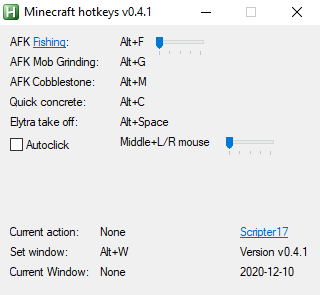

# Minecraft-Hotkeys

An [AutoHotKey](https://www.autohotkey.com/) script for automating various things in Minecraft  
Original concept (and a few button timings) stolen from [monpjc/XAHK](https://github.com/monpjc/XAHK)

## Instructions

When you open the script, the following GUI should appear

The instructions should be fairly understandable from there

## Features

- AFK fishing
- AFK mob grinding
  - Lets you repair multiple mending items by setting slots to swap into your offhand
- AFK cobblestone generator mining
- Quick concrete hardening
- Easy elytra takeoff
- Autoclick left/right mousebuttons with adjustable interval

The AFK ones work even after alt-tabbing out of minecraft if you have "pause on lost focus" (F3+P) disabled
